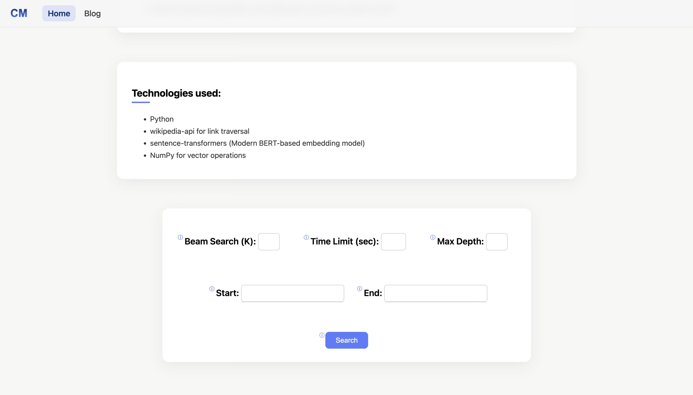

<h1><a href="https://huggingface.co/spaces/KrispyChris62/flask-app">Wikipedia Speed Runner</a></h1>

### Short Description:

Wikipedia Speed Runner is a web app that finds the shortest path between two Wikipedia articles using only the links within each page. It uses graph search algorithms like A*, optionally guided by semantic heuristics with word embeddings, and provides a simple Flask-based interface to explore results interactively.

## Features
<ul>
	<li>Find shortest paths between any two Wikipedia articles.</li>
	<li>Uses A* search for efficient pathfinding.</li>
	<li>Optional semantic heuristics using word embeddings to guide search.</li>
	<li>Flask web interface for user-friendly input and output.</li>
	<li>Displays path, number of links, and elapsed search time.</li>
</ul>

## Demo

